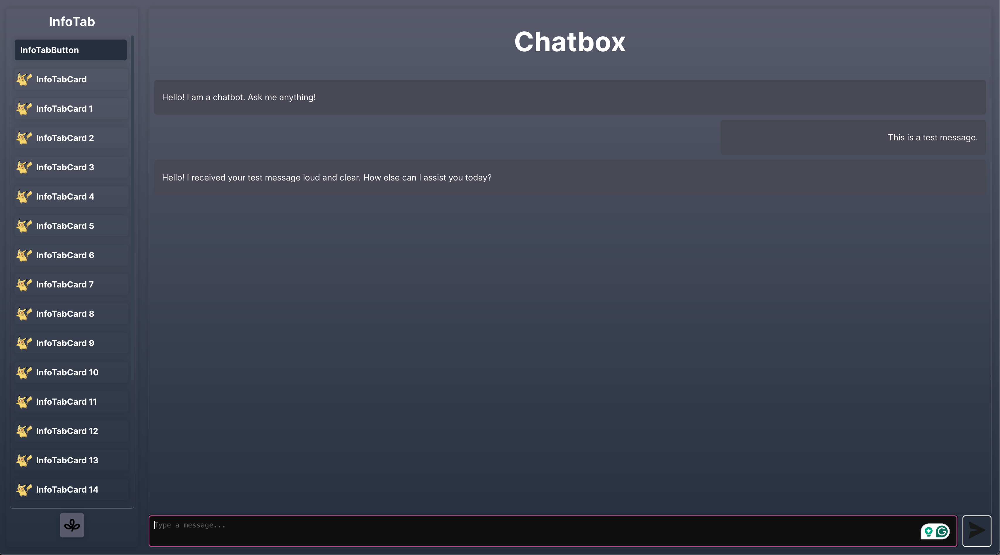

# recipes.ai

Hello! Welcome to the recipes.ai github project.

As a university student, I don't have all the time in the world (especially as an engineering student 😭). This also means that I don't have all the time in the world to cook amazing food for myself, or do research for new dishes and meals that would save more time.

Additionally, a lot of my friends do not even know how to cook.

That's why when I came up with the idea for this project, I was ecstatic.

The idea is simple: create a website that allows users to input the ingredients they have in their kitchen, and the website will output a list of recipes that can be made with those ingredients.

### Some Minor Notes

The website is currently NOT online. Because of 2 simple reasons.

1. It's not done yet
2. I'm also broke so I gotta find free hosting solutions

## Tech Stack

- Frontend: React.js
- Backend: Django
- Database: PostgreSQL

## How to run the project

1. Clone the repository
2. Navigate to the `backend` directory
3. Run `pip install -r requirements.txt`
4. Run `python manage.py runserver`
5. Navigate to the `frontend` directory
6. Run `npm install`
7. Run `npm run dev`

## Testing the Project

So I'm still building up all the test cases that I need, but I've started with simply testing the CRUD API for users! This works really well and I'm pretty proud about it.

So far:

- CRUD API for `users`
- CRUD API for `conversations`
- CRUD API for `messages`
- CRUD API for `recipes`
- and more...

## Contributing

If you would like to contribute to this project, please feel free to fork the repository and submit a pull request. I would love to see what you can come up with!

## License

This project is licensed under the Apache License.
